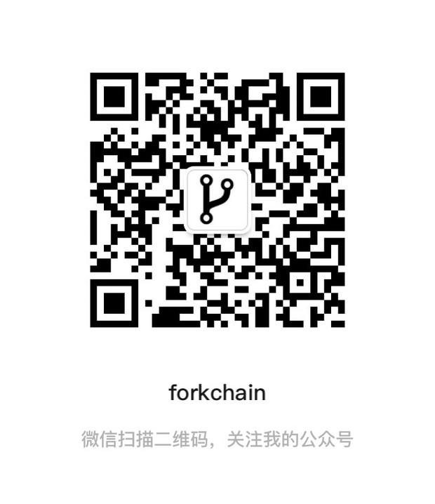
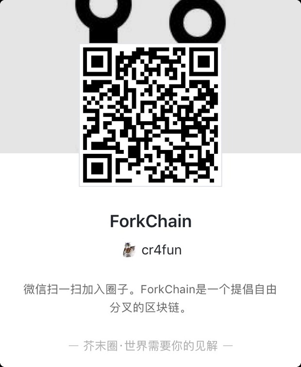

# alpha


### 安装

```
npm install
```

### 启动

启动节点1
```
HTTP_PORT=3001 P2P_PORT=6001 npm start
```

启动节点2
```
HTTP_PORT=3002 P2P_PORT=6002 npm start
```

启动节点3
```
HTTP_PORT=3003 P2P_PORT=6003 npm start
```

### 配置节点

```
curl -H "Content-type:application/json" --data '{"peer" : "ws://localhost:6001"}' http://localhost:3001/addPeer
```

```
curl -H "Content-type:application/json" --data '{"peer" : "ws://localhost:6002"}' http://localhost:3001/addPeer
```

```
curl -H "Content-type:application/json" --data '{"peer" : "ws://localhost:6003"}' http://localhost:3001/addPeer
```

### 查看节点

```
curl http://localhost:3001/peers
```

### 创世

```
curl http://localhost:3001/g
```

### 查询区块

```
curl http://localhost:3001/blocks/all
```

```
curl http://localhost:3002/blocks/all
```

```
curl http://localhost:3003/blocks/all
```


### 用户操作

新建用户

```
node newuser.js
```

```
 你要把助忆词和地址抄在安全的地方，key文件里仅仅保存私钥。 

+--------------+---------------------------------------------------------------------------------------+
|  mnemonic    | analyst merit gown expect lake crouch either radio achieve provide half total         |
|  Privatekey  | 5JdGzR28pdh6c3vKrwLuQvWXbznJmrPwE81qurSVZzf8SwCtsDY                                   |
|  Publickey   | GPH6HqQmNUBb3AqTfW7MtBqVCPXDJuKnZVEeyxPNk64sE6QYQKyH5                                 |
|  Address     | GPH9Jw8v7vmqKTaMjJpac2xefehQ7d9nJkAm                                                  |
+------------  +---------------------------------------------------------------------------------------+

```
显示用户

```
node showuser.js
```

```
这是你的信息 

+--------------+---------------------------------------------------------------------------------------+
|  Privatekey  | 5JdGzR28pdh6c3vKrwLuQvWXbznJmrPwE81qurSVZzf8SwCtsDY                                   |
|  Publickey   | GPH6HqQmNUBb3AqTfW7MtBqVCPXDJuKnZVEeyxPNk64sE6QYQKyH5                                 |
|  Address     | GPH9Jw8v7vmqKTaMjJpac2xefehQ7d9nJkAm                                                  |
+------------  +---------------------------------------------------------------------------------------+
```

### 信息上链

```
node msg.js haha localhost 3001
```

### 交流

欢迎关注公众号 ForkChain



欢迎进入芥末圈



### 备注

> 区块链的部分是我自己写的，p2p 这部分主要来源于 https://github.com/zfzGit/P2PNodejs/blob/master/main.js  项目。
